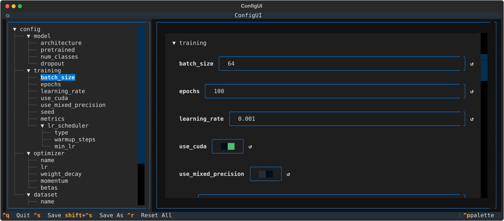

# ConfigUI

[](https://github.com/chenchaozhao/configui/actions/workflows/tests.yml)
[](https://pypi.org/project/configui/)
[](https://www.python.org/)
[](LICENSE)

Turn YAML, JSON, and TOML configuration files into a terminal user interface (TUI) — no IDE required.

---

## Installation

```bash
# Install from PyPI
uv tool install configui

# Or with pip
pip install configui
```

## Quickstart

```bash
configui path/to/config.yaml
```

Open a configuration file in the interactive TUI editor. Edit values, toggle booleans, navigate nested structures — everything stays type-aware. Try it with the sample configs in `samples/`:

```bash
configui samples/training_config.yaml
configui samples/training_config.json
configui samples/training_config.toml
```

```bash
configui path/to/config.yaml -r  # Read-only mode
```



## Features

- **Type-aware editing** — booleans become checkboxes, numbers get numeric inputs, nested objects become collapsible sections.
- **Multi-format** — YAML (with comment preservation via `ruamel.yaml`), JSON, and TOML (with `tomlkit`).
- **Read-only mode** — inspect configs without accidental edits (`-r` flag).
- **Save or Save As** — overwrite the original or write to a new path.
- **Comment preservation** — your YAML and TOML comments stay intact.

## Supported Formats

| Format | Library | Comments preserved |
|--------|---------|-------------------|
| YAML   | ruamel.yaml | ✅ |
| JSON   | stdlib json | ❌ (not supported by format) |
| TOML   | tomlkit     | ✅ |

## Development

```bash
uv tool install hatch
hatch run release   # fmt → typing → test with coverage
```

## License

MIT
